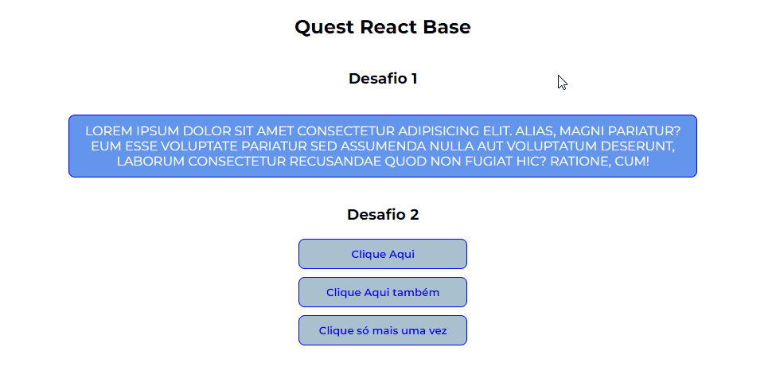

# Solução da quest - React-Base

🧾✍ Essa é uma solução da quest do curso do [DevQuest](https://www.linkedin.com/school/devquest-dev-em-dobro/about/).

## Sumário

- [Visão Geral](#visão-geral)
  - [O desafio](#o-desafio)
  - [Screenshot e gifs](#screenshot-e-gifs)
- [Meu processo](#meu-processo)
  - [Tecnologias utilizadas](#tecnologias-utilizadas)
  - [Funcionalidade do projeto](#funcionalidade-do-projeto)
  - [Desenvolvimento contínuo](#desenvolvimento-contínuo)
  - [Agradecimentos](#agradecimentos)
  - [Recursos úteis](#recursos-úteis)
- [Autor](#autor)


## Visão-geral

### O desafio

Objetivos da quest:

- Renderizar um parágrafo em tela utilizando código JSX de React
- A estilização do parágrafo deve ser feito através de seu componente e suas props
- Ao clicar nos botões um evento deve ser ativado, acionando um ```alert``` que mostra qual é o valor da label de cada um

### Screenshot e gifs

#### Funcionalidade do projeto



## Meu processo

### Tecnologias utilizadas

- JSX
- JavaScript
- React
- Vite

### Funcionalidade do projeto

São dois desafios em um. O primeiro é fazer com que um componente renderize na tela um parágrafo colorido e com todas as letras maiúsculas usando JS.

```jsx
const Text = ({ setBackgroundColor, setLetterSize, text, setTextColor }) => {
    return <p
        className="text"
        style={{ textTransform: setLetterSize, 
                 backgroundColor: setBackgroundColor,
                 color: setTextColor }}>
        {text}
    </p>
}
```

Foi passado propriedades padrão para o parágrafo.

```jsx
Text.defaultProps = {
    setLetterSize: 'uppercase',
    setBackgroundColor: 'cornflowerblue'
}
```

O segundo desafio solicitava que, ao clicar em um determinado botão, um ```alert``` seria acionado com a mensagem "A label desse botão é 'nome da label' ". Para isso, criei um componente específico para o botão e outro componente que contêm todos os botões que serão renderizados na tela.

**Componente Button**
```jsx
const Button = ({ label, labelContent }) => {
    return <button
        onClick={() => labelContent(label)}>
        {label}
    </button>
}
```

**Componente Buttons**
```jsx
const showLabelContent = (labelContent) => {
    alert(`A label desse botão é "${labelContent}"`)
}

const buttonsLabel = [undefined, 'Clique Aqui também', 'Clique só mais uma vez']

const Buttons = () => {
    return (
        <div className="buttons">
            { buttonsLabel.map((label, index) =>
                <Button
                    key={index}
                    label={label}
                    labelContent={showLabelContent}
                />
            )}
        </div>
    )
}
```

Dessa forma, foi possível renderizar vários botões na tela somente utilizando o método ```.map```, além disso, ao clicar no botão, é acionado o método ```onClick``` que aciona a função ```showLabelContent```. Assim, ao clicar no botão, ele renderiza a mensagem, além de possuir o valor da label de cada botão para ser mostrada.

### Desenvolvimento contínuo

Esse código foi o primeiro a ser desenvolvido em React, isso graças a equipe [DevQuest](https://www.linkedin.com/school/devquest-dev-em-dobro/about/) que me proporcionou essa oportunidade e ampliar os meus conhecimentos com aulas e uma didática incríveis.

## Autor

- GitHub - [Felipe Santiago Morais](https://github.com/SantiagoMorais)
- Linkedin - [Felipe Santiago](https://www.linkedin.com/in/felipe-santiago-873025288/)
- Frontend Mentor - [@FelipeSantiagoMorais](https://www.frontendmentor.io/profile/SantiagoMorais)
- Instagram - [@felipe.santiago.morais](https://www.instagram.com/felipe.santiago.morais)
